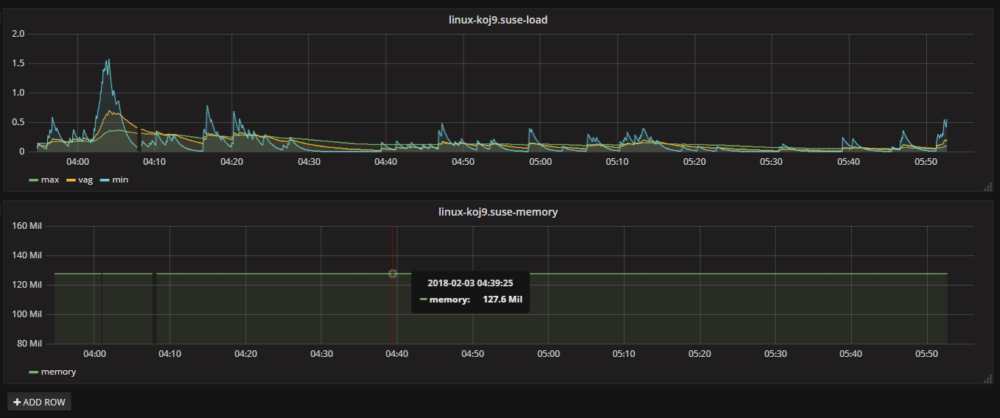

grafana+influxdb+collectd
=================
&nbsp;&nbsp;&nbsp;&nbsp;granfana是一个open source的图形化数据展示工具，可以自定义datasource，自定义报表、显示数据等。

&nbsp;&nbsp;&nbsp;&nbsp;influxdb是一个开源的分布式时序、时间和指标数据库，使用go语言编写，无需外部依赖。本文将需要监控的数据写入influxdb，利用granfana展示出来。

&nbsp;&nbsp;&nbsp;&nbsp;collectd是C语言编写的一个系统性能采集工具。本文部署搭建的环境将collectd采集的数据写入influxdb，利用granfana展示出系统性能指标。

&nbsp;&nbsp;&nbsp;&nbsp;另外，为了让大家能够在自己的系统中，使用influxdb采集数据，写了一个功能比较全的采集模块，稍微改造下，就可以应用在各自应用中，作为应用监控数据采集模块。

# 1. influxdb

&nbsp;&nbsp;&nbsp;&nbsp;本人下载使用的是当前最新版本的influxdb-1.4.2_linux_amd64.tar.gz，如果大家想搭建有web控制台的influxdb，需要选择低版本的，此处不做介绍，influxdb官方在高版本不知为啥去掉了该模块，但是利用influxdb命令行控制台依旧可以完成所有工作，而且可以加深大家对influxdb的使用与理解。

## 1.1 安装

- &nbsp;1. 解压
~~~sh
tar -xvf influxdb-1.4.2_linux_amd64.tar.gz
~~~

- &nbsp;2. 解压包中，influxdb配置文件在etc/influxdb/influxdb.conf中（暂时可能不需要改造，后面collectd收集时候，需要更改配置），但是此处有一个“大坑”，该配置无论怎么更改，都不会起作用，因为influxdb启动后，依赖的配置在系统目录层次下/etc/influxdb/influxdb.conf，此处浪费我很多时间，所以大家新建/etc/influxdb目录，然后将influxdb.conf拷贝到该目录下。
~~~sh
su root
mkdir /etc/influxdb
cp /home/xqhuang/workspace/env/influxdb/influxdb-1.4.2-1/etc/influxdb/influxdb.conf /etc/influxdb/influxdb.conf
~~~

- &nbsp;3. 进入到/home/xqhuang/workspace/env/influxdb/usr/bin目录下，启动influxd，即可启动influxdb。
~~~sh
sudo nohup ./influxd &
~~~

- &nbsp;4. 连上influxdb客户端，测试influxdb使用情况。
~~~sh
./influx
~~~

## 1.2 influxdb常用概念与命令

&nbsp;&nbsp;&nbsp;&nbsp;influxdb时序数据库有一套功能强大的类sql语法，但是操作好该语法，需要了解influxdb时序数据库的一些概念。

#### 1.2.1 常用概念

&nbsp;&nbsp;&nbsp;&nbsp;influxdb时序数据库有部分概念与传统数据库概念相似：
<table>
  <tr>
    <th width=40%, bgcolor=yellow >influxdb概念</th>
    <th width=60%, bgcolor=yellow>传统数据库概念</th>
  </tr>
  <tr>
    <td bgcolor=#eeeeee> database  </td>
    <td> 数据源 </td>
  </tr>
  <tr>
    <td bgcolor=#eeeeee> measurement  </td>
    <td> 数据库中的表 </td>
  </tr>
  <tr>
    <td bgcolor=#eeeeee> point </td>
    <td> 表中的一行数据 </td>
  </tr>
</table>

&nbsp;&nbsp;&nbsp;&nbsp;influxdb独有的一些概念：point和series。

&nbsp;&nbsp;&nbsp;&nbsp;point由时间戳（time）、数据（field）、标签（tags）组成，point相当于传统传统数据库里的一行数据，如下表所示：
<table>
  <tr>
    <th width=40%, bgcolor=yellow >point属性</th>
    <th width=60%, bgcolor=yellow>描述</th>
  </tr>
  <tr>
    <td bgcolor=#eeeeee> time </td>
    <td> 每个数据记录生产时间，是数据库的主索引（若插入时候没有则自动生产) </td>
  </tr>
  <tr>
    <td bgcolor=#eeeeee> tag </td>
    <td> 各种有索引的属性 </td>
  </tr>
  <tr>
    <td bgcolor=#eeeeee> field </td>
    <td> 没有索引的属性，各种记录值 </td>
  </tr>
</table>

&nbsp;&nbsp;&nbsp;&nbsp;series表示某张表里面的数据，可以在图表上面画出几条线：通过tag排列组合算出来的。下图为collectd统计cpu_value的series，如下所示：
~~~sh
xqhuang@linux-koj9:~/workspace/env/influxdb/influxdb-1.4.2-1/usr/bin> ./influx
Connected to http://localhost:8086 version 1.4.2
InfluxDB shell version: 1.4.2
> use collectd;
Using database collectd
> show measurements;
name: measurements
name
----
cpu_value
interface_rx
interface_tx
load_longterm
load_midterm
load_shortterm
memory_value
> show series from cpu_value;
key
---
cpu_value,host=linux-koj9.suse,instance=0,type=cpu,type_instance=idle
cpu_value,host=linux-koj9.suse,instance=0,type=cpu,type_instance=interrupt
cpu_value,host=linux-koj9.suse,instance=0,type=cpu,type_instance=nice
cpu_value,host=linux-koj9.suse,instance=0,type=cpu,type_instance=softirq
cpu_value,host=linux-koj9.suse,instance=0,type=cpu,type_instance=steal
cpu_value,host=linux-koj9.suse,instance=0,type=cpu,type_instance=system
cpu_value,host=linux-koj9.suse,instance=0,type=cpu,type_instance=user
cpu_value,host=linux-koj9.suse,instance=0,type=cpu,type_instance=wait
~~~

#### 1.2.2 常用命令

<table>
  <tr>
    <th width=40%, bgcolor=yellow >命令</th>
    <th width=60%, bgcolor=yellow>操作</th>
  </tr>
  <tr>
    <td bgcolor=#eeeeee> 显示数据库 </td>
    <td>show databases</td>
  </tr>
  <tr>
    <td bgcolor=#eeeeee> 新建数据库 </td>
    <td>create database tmp</td>
  </tr>
  <tr>
    <td bgcolor=#eeeeee> 删除数据库 </td>
    <td>drop database tmp</td>
  </tr>
  <tr>
    <td bgcolor=#eeeeee> 使用某个数据库 </td>
    <td> use database collectd </td>
  </tr>
  <tr>
    <td bgcolor=#eeeeee> 显示所有表  </td>
    <td> show measurements </td>
  </tr>
 <tr>
   <td bgcolor=#eeeeee> 新建表 </td>
   <td>没有显示新建表的命令，通过插入记录新建表</td>
 </tr>
 <tr>
    <td bgcolor=#eeeeee> 插入记录 </td>
    <td>insert disk_free,hostname=localhost value=442221834240i 1435362189575692182</td>
 </tr>
 <tr>
    <td bgcolor=#eeeeee> 查询记录 </td>
    <td>select * from disk_free</td>
 </tr>
 <tr>
    <td bgcolor=#eeeeee> 删除记录/更新记录 </td>
    <td>不支持</td>
  </tr>
  <tr>
    <td bgcolor=#eeeeee> 删除表 </td>
    <td>drop measurement disk_fres</td>
  </tr>
  <tr>
    <td bgcolor=#eeeeee> 显示series</td>
    <td>show series from cpu_value</td>
  </tr>
</table>

# 2. collectd

&nbsp;&nbsp;&nbsp;&nbsp;本人下载的是collectd-5.8.0.tar.bz2，通过编译安装完成。

## 2.1 安装

- &nbsp;1. 解压
~~~sh
tar -xvf collectd-5.8.0.tar.bz2
~~~

- &nbsp;2. 进入collectd-5.8.0目录，执行编译安装，注意安装时候选择管理员权限操作，否则会导致安装失败。
~~~sh
./configure
sudo make all install 
~~~

- &nbsp;3. 编译安装后，collectd安装在目录/opt/collectd目录下，配置文件在etc/collectd.conf，配置文件较为复杂，建议先备份配置文件，colelctd启动脚本文件sbin/collectd。

- &nbsp;4. 配置collectd.conf文件，让收集的采集信息发到influxdb接受，其中192.168.171.131为influxdb部署的机器ip，25826为其监听的端口。
~~~txt
<Plugin network>
        <Server "192.168.171.131" "25826">
        </Server>
......
</Plugin>
~~~

- &nbsp;5. influxdb开启collectd收集插件，修改配置/etc/influxdb/influxdb.conf，然后关闭influxdb，然后重新启动influxdb，其中需要注意一下typesdb文件，因为我的influxdb和collectd在同一台机器上面，我直接使用的ollectd的目录下面该文件，若部署在不同机器上面，需要将collectd目录下的该文件拷贝到influxdb机器上面，把该配置指向该文件。
~~~txt
[[collectd]]
  enabled = true
  bind-address = ":25826"
  database = "collectd"
  # retention-policy = ""
  #
  # The collectd service supports either scanning a directory for multiple types
  # db files, or specifying a single db file.
  typesdb = "/opt/collectd/share/collectd"
  #
  # security-level = "none"
  # auth-file = "/etc/collectd/auth_file"

  # These next lines control how batching works. You should have this enabled
  # otherwise you could get dropped metrics or poor performance. Batching
  # will buffer points in memory if you have many coming in.

  # Flush if this many points get buffered
  batch-size = 5000

  # Number of batches that may be pending in memory
  batch-pending = 10

  # Flush at least this often even if we haven't hit buffer limit
  batch-timeout = "10s"
~~~
&nbsp;&nbsp;&nbsp;&nbsp;重启后，检查一下influxdb的collectd插件是否打开，可以看起监听端口是否存在，存在则表示数据已经开始收集。
~~~sh
xqhuang@linux-koj9:/etc/influxdb> sudo netstat -apn | grep influ
root's password:
tcp        0      0 127.0.0.1:8088          0.0.0.0:*               LISTEN      4908/influxd        
tcp        0      0 :::8086                 :::*                    LISTEN      4908/influxd        
tcp        0      0 ::1:38011               ::1:8086                ESTABLISHED 4915/influx         
tcp        0      0 ::1:8086                ::1:38011               ESTABLISHED 4908/influxd        
udp        0      0 :::25826                :::*                                4908/influxd 
~~~
&nbsp;&nbsp;&nbsp;&nbsp;另外，还可以用influx打开客户端，看一下数据库源collectd下面有没有各项统计表。
~~~sh
xqhuang@linux-koj9:~/workspace/env/influxdb/influxdb-1.4.2-1/usr/bin> ./influx
Connected to http://localhost:8086 version 1.4.2
InfluxDB shell version: 1.4.2
> use collectd;
Using database collectd
> show measurements;
name: measurements
name
----
cpu_value
interface_rx
interface_tx
load_longterm
load_midterm
load_shortterm
memory_value
~~~

# 3. grafana

&nbsp;&nbsp;&nbsp;&nbsp;本人下载的是grafana-4.6.3.linux-x64.tar.gz版本。

## 3.1 安装

- &nbsp;1. 解压
~~~sh
tar -xvf grafana-4.6.3.linux-x64.tar.gz
~~~

- &nbsp;2. 解压后，配置文件在conf/defaults.ini下面，需要注意，影响启动的配置是database，数据源指的是grafana本身用的数据库，主要包括账号管理，配置的图表等信息，我使用的是默认的文件数据库sqlite3，你可以根据情况选择你的数据库。

- &nbsp;3. 启动grafana，启动脚本在bin/grafana-server，启动默认端口为3000，管理员密码再defaults.ini中已经配置，下图为grafana home页面，其中test和collectd是我建好的两个监控面板。
~~~sh
nohup ./grafana-server &
~~~

## 3.1 数据采集

&nbsp;&nbsp;&nbsp;&nbsp;grafana采集展示的是influxdb的collectd和我编码一直插入的数据（代码比较多，详细见grafana-ch1），使用前需要先配置数据源啥的，页面操作具体自己玩，有啥不懂的可以网上找找，这类比较多。

- &nbsp;1. 采集collectd数据示例

&nbsp;&nbsp;&nbsp;&nbsp;下图展示可能比较奇怪，我稍微解释一下啊，因为虚拟机和我本机时钟不匹配导致的，仅作为暂时，不做过多说明，故意把展示区间设置在虚拟机时间左右，暂时的图如下：

- &nbsp;2. 自己写测试例子，主动向influxdb插入数据

&nbsp;&nbsp;&nbsp;&nbsp;下图展示也比较奇怪，原因也是因为时钟不一致导致的，故意把区间调到可以展示的区间范围内。

