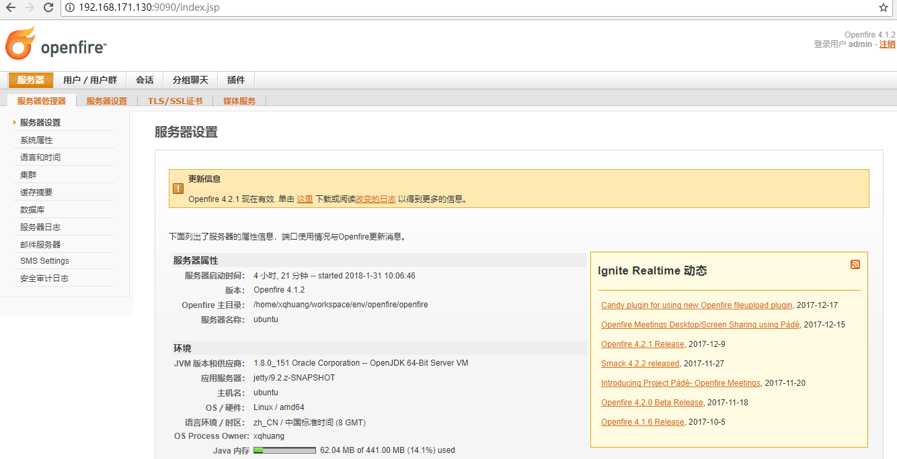
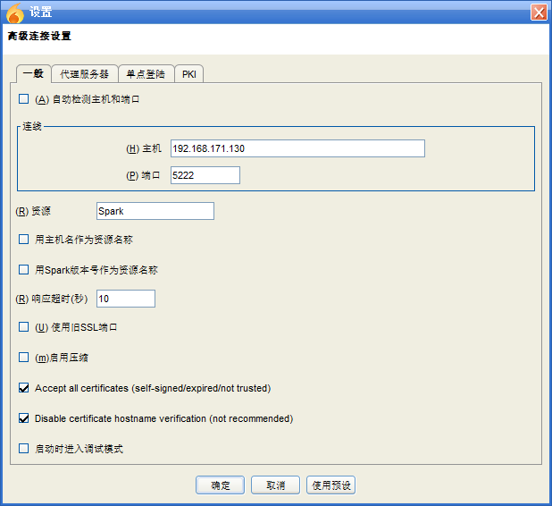
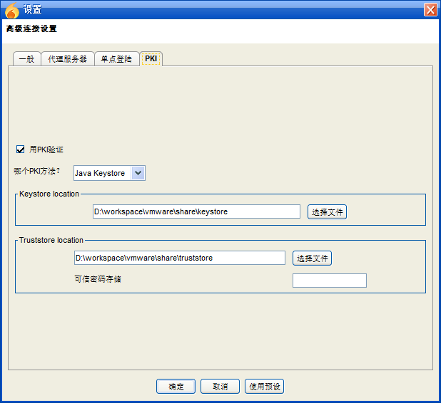
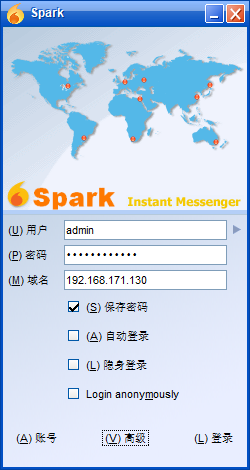
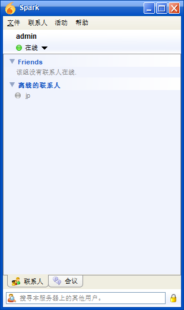

openfire
=================

# 1. openfire是啥？

&nbsp;&nbsp;&nbsp;&nbsp;openfire最主要的功能是实现XMPP服务器，简单来说，openfire为我们提供一个固定的地址，我们只需要向openfire服务器发送标准的XMPP信息（即XML文件流），那么openfire服务器应当给予我们回应，这里的openfire服务器也可以看做一个容器，我们在聊天时，需要在这个服务器上注册一个会话，在会话存在的时间，我们可以实现即时聊天的一些常用功能，比如建立自己的组，添加好友，聊天，以及传送文件等等，同时，openfire服务器也需要实现自己的管理界面，这样openfire服务器也扮演一个web容器的角色。

&nbsp;&nbsp;&nbsp;&nbsp;openfire是开源的实时协作服务器（RTC）,它是基于公开协议XMPP（也成为Jabber）消息的，核心功能可以概括为：连接管理、消息解析、消息路由、消息发送。

&nbsp;&nbsp;&nbsp;&nbsp;openfire具有跨平台的能力，openfire与客户端采用的是C/S架构，一个服务器要负责为连接在其上的客户端提供服务。openfire客户端有spark, pidgin, Miranda IM, iChat等，用户如果自己开发客户端，可以采用遵循GPL的开源Client端API--Smack。

&nbsp;&nbsp;&nbsp;&nbsp;openfire服务器端支持插件开发，如果开发者需要添加新的服务，可以开发出自己的插件后，安装至服务器，就可以提供服务，如查找联系人服务就是以插件的形式提供的。

# 2. 安装与部署

# 2.1 openfire安装

&nbsp;&nbsp;&nbsp;&nbsp;本人下载的openfire版本是4.1.2（tar.gz），首先解压指定目录下：
~~~sh
tar -xvf openfire_4_1_2.tar.gz
~~~

&nbsp;&nbsp;&nbsp;&nbsp;解压后进入bin目录，启动openfire：（默认web服务启动端口为9090）
~~~sh
./openfire start
~~~

&nbsp;&nbsp;&nbsp;&nbsp;第一次启动openfire，需要配置openfire数据源，本人采用的是mysql数据库。

# 2.2 mysql安装

&nbsp;&nbsp;&nbsp;&nbsp;本人新建了一个ubantu的虚拟机，下载的版本是mysql-5.7.21-1.sles11.x86_64.rpm-bundle.tar。

&nbsp;&nbsp;&nbsp;&nbsp;解压mysql安装包，获取到8个rpm子安装包。
~~~sh
tar -xvf mysql-5.7.21-1.sles11.x86_64.rpm-bundle.tar
~~~

&nbsp;&nbsp;&nbsp;&nbsp;安装mysql rpm安装包要注意顺序，另外不需要安装所有的rpm包。
~~~sh
sudo rpm -ivh mysql-community-common-5.7.21-1.sles11.x86_64.rpm
sudo rpm -ivh mysql-community-libs-5.7.21-1.sles11.x86_64.rpm
sudo rpm -ivh mysql-community-client-5.7.21-1.sles11.x86_64.rpm
sudo rpm -ivh mysql-community-server-5.7.21-1.sles11.x86_64.rpm
~~~

&nbsp;&nbsp;&nbsp;&nbsp;mysql第一次启动，由于root密码不知道，因此无法通过客户端连接，可以更改mysql全局配置，不进行密码验证，全局配置在/etc/my.cnf，修改配置文件如下，添加“skip-grant-tables=1 #不用验证”。
~~~txt
# For advice on how to change settings please see
# http://dev.mysql.com/doc/refman/5.7/en/server-configuration-defaults.html

[mysqld]
#
# Remove leading # and set to the amount of RAM for the most important data
# cache in MySQL. Start at 70% of total RAM for dedicated server, else 10%.
# innodb_buffer_pool_size = 128M
#
# Remove leading # to turn on a very important data integrity option: logging
# changes to the binary log between backups.
# log_bin
#
# Remove leading # to set options mainly useful for reporting servers.
# The server defaults are faster for transactions and fast SELECTs.
# Adjust sizes as needed, experiment to find the optimal values.
# join_buffer_size = 128M
# sort_buffer_size = 2M
# read_rnd_buffer_size = 2M
datadir=/var/lib/mysql
socket=/var/lib/mysql/mysql.sock
skip-grant-tables=1 #不用验证

# Disabling symbolic-links is recommended to prevent assorted security risks
symbolic-links=0

log-error=/var/log/mysql/mysqld.log
pid-file=/var/run/mysql/mysqld.pid
~~~

&nbsp;&nbsp;&nbsp;&nbsp;启动mysql服务：
~~~sh
sudo /etc/init.d/mysql start
~~~

&nbsp;&nbsp;&nbsp;&nbsp;登陆mysql客户端，更改root用户密码，并且非localhost（指定IP）连接mysql服务，需要将localhost更改为“%”。
~~~sh
 mysql -uroot –p
 mysql> use mysql;
 mysql> SET PASSWORD = PASSWORD('root'); #设置密码为root
 mysql> update user set host='%' where user='root'; #允许非localhost连接mysql
 mysql> flush privileges; #刷新设置
 ~~~
 
 &nbsp;&nbsp;&nbsp;&nbsp;将mysql启动忽略密码验证项取消，注释掉skip-grant-tables该行，重新启动mysql服务。
 ~~~sh
 sudo /etc/init.d/mysql restart
 ~~~
 
# 2.3 初始化openfire
 
&nbsp;&nbsp;&nbsp;&nbsp;openfire解压包下面/resources/database下面有场景数据库表的创建脚本，选择mysql数据库安装脚本openfire_mysql.sql。

&nbsp;&nbsp;&nbsp;&nbsp;连接mysql客户端：
 ~~~sh
mysql -uroot –proot
 ~~~
 
&nbsp;&nbsp;&nbsp;&nbsp;创建数据库openfire，然后执行mysql数据库安装脚本。
 ~~~sh
 mysql> create database openfire;
 mysql> use openfire;
 mysql> ###拷贝openfire_mysql.sql安装脚本，贴到此处执行执行，数据库即安装完毕###
 ~~~
 
 &nbsp;&nbsp;&nbsp;&nbsp;openfire选择初始化数据库jdbc:mysql://192.168.171.131:3306/openfire?rewriteBatchedStatements=true，用户名密码分别是root/root，下一步配置openfire管理员密码openfire，即完成openfire初始化过程，重新登陆即可管理员登陆页面。
 
 
  
# 2.4 安装XMPP客户端Spark
 
&nbsp;&nbsp;&nbsp;&nbsp;下载Spark Window10版本，安装后，点击高级配置详细启动参数。

&nbsp;&nbsp;&nbsp;&nbsp;标签“一般”配置如下，默认的客户端到服务器端口为5222，可以根据情况在openfire管理页面重新设置，：

&nbsp;&nbsp;&nbsp;&nbsp;标签“PKI”配置如下，其中证书是从openfire安装包（/home/xqhuang/workspace/env/openfire/openfire/resources/security）下面copy出来的：

&nbsp;&nbsp;&nbsp;&nbsp;登陆页面如下：

&nbsp;&nbsp;&nbsp;&nbsp;登陆成功后，界面类似于一般的聊天应用，添加好友（可以直接在openfire管理平台添加用户，可以通过Spart注册新用户）后就可以进行聊天了。
