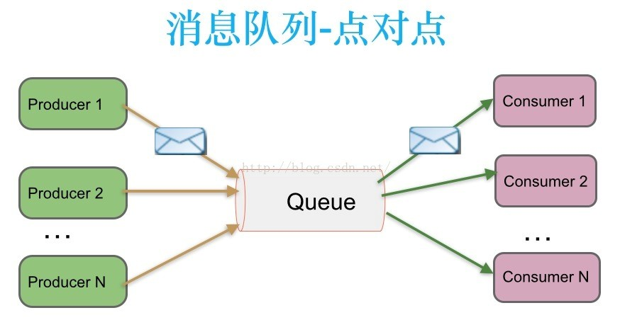
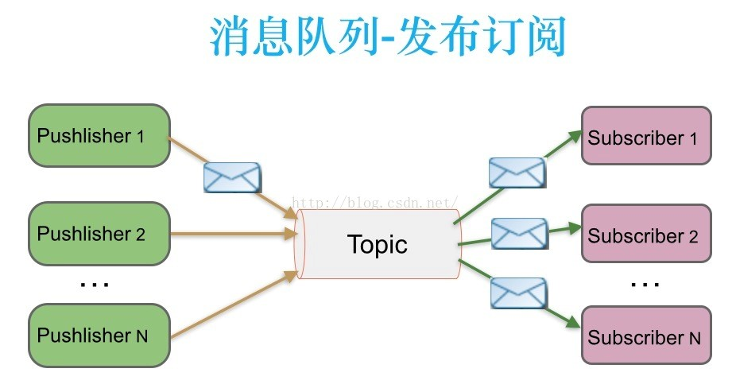
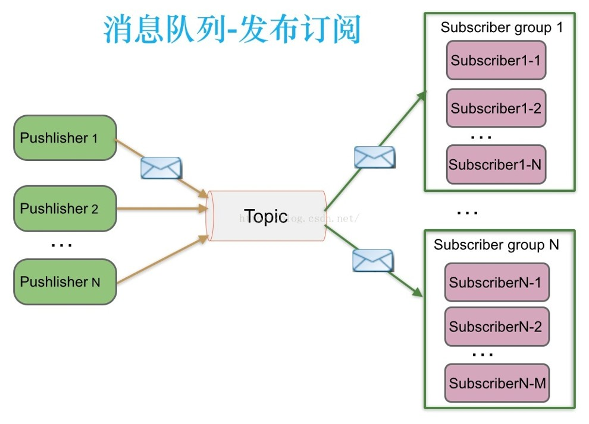

rocketmq
=================
&nbsp;&nbsp;&nbsp;&nbsp;rocketmq是一个纯java、分布式、队列模型的开源消息中间件，前身是metaq，当metaq 3.0发布时，产品名称改为rocketmq。

# 1. 消息中间件

&nbsp;&nbsp;&nbsp;&nbsp;传统的分布式对象调用应用广泛，但面对复杂的分布式系统，显示出一些局限性，比如模块间耦合度较高，同步通信延迟较高，消息中间件是一个中间层软件。消息队列中间件是分布式系统中重要的组件，主要解决应用解耦，异步消息，流量削锋等问题，实现高性能，高可用，可伸缩和最终一致性架构。

## 1.1 特点

- 1.可靠性：基于消息的通信是可靠的，大多数消息中间件都提供将消息持久化到磁盘的功能，可以发送离线消息，消息不会丢失。在分布式事务中担当重要的角色。

- 2.异步：基于事件驱动架构，将调用异步化。

- 3.分布式：消息中间件都是分布式的。

- 4.高效的数据分发:高效的算法，提高消息的吞吐率以及高效的消息投递路由。

## 1.2 应用场景

- 1. 系统集成

&nbsp;&nbsp;&nbsp;&nbsp;系统集成，除了可以通过接口，还可以通过消息。两者不同在于接口是模块间直接调用,而有消息中间件的系统模块间通过消息模块通信，通过消息分解系统。

- 2. 降低系统耦合性

&nbsp;&nbsp;&nbsp;&nbsp;如果模块之间不存在直接调用，那么修改或新增模块对其他模块影响最小。增加消息中间件后，业务模块仅需关注自己的业务逻辑和如何将消息发送给消息服务器，消息由中间件存储和分发。B宕机不会影响A，B系统瓶颈也不会成为A的瓶颈。也可以解决分布式事务问题。

&nbsp;&nbsp;&nbsp;&nbsp;直接接口调用存在的耦合（A调B）：

&nbsp;&nbsp;&nbsp;&nbsp;对于A：

&nbsp;&nbsp;&nbsp;&nbsp;&nbsp;&nbsp;&nbsp;&nbsp;1.存储要发送的消息,防止A或B宕机，信息丢失。

&nbsp;&nbsp;&nbsp;&nbsp;&nbsp;&nbsp;&nbsp;&nbsp;2.处理B的回调信息。

&nbsp;&nbsp;&nbsp;&nbsp;对于B：

&nbsp;&nbsp;&nbsp;&nbsp;&nbsp;&nbsp;&nbsp;&nbsp;1.设计接口通信协议，整合同构或异构的系统。

&nbsp;&nbsp;&nbsp;&nbsp;&nbsp;&nbsp;&nbsp;&nbsp;2.考虑系统的伸缩性，B的瓶颈会成为A的瓶颈，如何扩展。

&nbsp;&nbsp;&nbsp;&nbsp;&nbsp;&nbsp;&nbsp;&nbsp;3.保存回调消息，防止宕机造成消息丢失。

&nbsp;&nbsp;&nbsp;&nbsp;&nbsp;&nbsp;&nbsp;&nbsp;4.处理成功后通知A。

&nbsp;&nbsp;&nbsp;&nbsp;在分布式事务中，通过本地事务和消息服务器的配合，保证数据最终一致性。

- 3. 改善系统性能

&nbsp;&nbsp;&nbsp;&nbsp;使用消息的异步调用，用户请求的数据发送给消息队列后立即返回，不用等接受者处理好数据，系统具有更好的响应延迟。在网站访问的高峰，消息中间件有一定的缓冲作用，减轻数据库和后端存储的负载压力。

- 4. 跨平台

&nbsp;&nbsp;&nbsp;&nbsp;降低网络协议的复杂性。

- 5. 提高系统可用性

&nbsp;&nbsp;&nbsp;&nbsp;基于消息的通信是可靠的，消息不会丢失。可以发送事务性消息，而且大多数消息中间件都提供将消息持久化到磁盘的功能。

- 6. 流量削峰

&nbsp;&nbsp;&nbsp;&nbsp;流量削锋也是消息队列中的常用场景，一般在秒杀或团抢活动中使用广泛。应用场景：秒杀活动，一般会因为流量过大，导致流量暴增，应用挂掉。为解决这个问题，一般需要在应用前端加入消息队列。可以做到：1）可以控制活动的人数；2）可以缓解短时间内高流量压垮应用。

## 1.3 引入消息中间件需要注意的地方

- 1. 复杂性

&nbsp;&nbsp;&nbsp;&nbsp;消息中间件都是分布式的，引入分布式会大大增加系统复杂度，在不同主机、不同进程之间的调用和调试，会带来更多的不稳定性。分布式系统还会增加对外部系统的依赖。即使自己的系统没有问题，也可能会因为依赖系统出问题而导致系统不稳定。

- 2. 异步调用

&nbsp;&nbsp;&nbsp;&nbsp;带来的业务交互的改变，有一定的操作延迟。

- 3. 同步调用

&nbsp;&nbsp;&nbsp;&nbsp;尽管消息中间件也可用于同步调用，但这并不是它的长项，同步调用可以考虑使用HTTP、NIO等其他方式。

## 1.3 消息模型

- 1. 点对点

- 2. 发布订阅-单一消费场景

- 3. 发布订阅-多种消费场景

# 2. rocketmq基本概念

<table>
  <tr>
    <th width=40%, bgcolor=yellow >概念</th>
    <th width=60%, bgcolor=yellow>说明</th>
  </tr>
  <tr>
    <td bgcolor=#eeeeee> Producer  </td>
    <td> 消息生产者，负责产生消息，一般由业务系统负责产生消息 </td>
  </tr>
  <tr>
    <td bgcolor=#eeeeee> Consumer  </td>
    <td> 消息消费者，负责消费消息，一般是后台系统负责异步消费 </td>
  </tr>
  <tr>
    <td bgcolor=#eeeeee> Push Consumer  </td>
    <td> Consumer的一种，应用通常向Consumer对象注册一个Listener接口，一旦收到消息，Consumer对象立刻回调Listener接口方法 </td>
  </tr>
  <tr>
    <td bgcolor=#eeeeee> Pull Consumer  </td>
    <td> Consumer的一种，应用通常主动调用Consumer的拉消息方法从Broker拉消息，主动权由应用控制 </td>
  </tr>
  <tr>
    <td bgcolor=#eeeeee> Producer Group  </td>
    <td> 一类Producer的集合名称，这类Producer通常发送一类消息，且发送逻辑一致 </td>
  </tr>
  <tr>
    <td bgcolor=#eeeeee> Consumer Group  </td>
    <td> 一类Consumer的集合名称，这类Consumer通常消费一类消息，且消费逻辑一致 </td>
  </tr>
  <tr>
    <td bgcolor=#eeeeee> Broker  </td>
    <td> 消息中转角色，负责存储消息，转发消息，一般也称为Server </td>
  </tr>
   <tr>
      <td bgcolor=#eeeeee> Name Server  </td>
      <td> rocketmq名称服务器，更新和发现 broker服务 </td>
    </tr>
   <tr>
      <td bgcolor=#eeeeee> Broker Master  </td>
      <td> broker 消息主机服务器 </td>
    </tr>
   <tr>
      <td bgcolor=#eeeeee> Broker Slave  </td>
      <td> broker 消息从机服务器 </td>
    </tr>
</table>